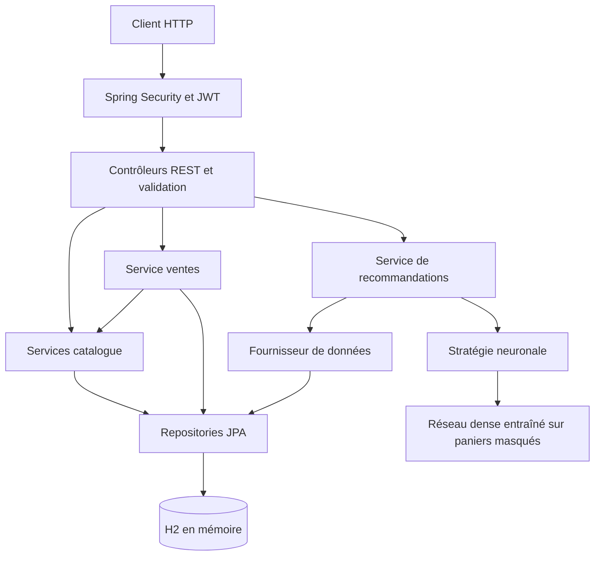
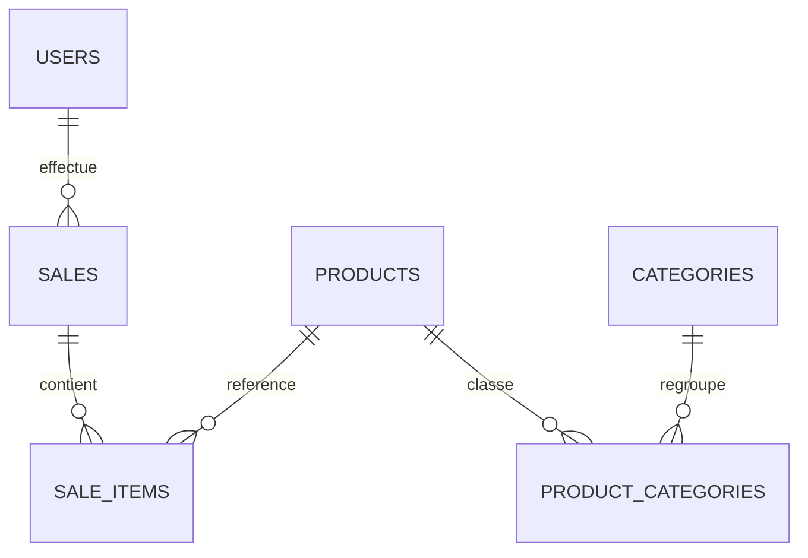

# ShopWise

ShopWise est une API de gestion du catalogue et des ventes pour les commerces de proximité.

Ce dépôt public rassemble les réponses techniques, le code, les tests et les
livrables de l'étude de cas iSCOD. Le périmètre est exclusivement backend.

## Lancement local

Prérequis : Java 21 et Maven. Le backend Spring Boot et la base H2 embarquée
s'exécutent dans un seul processus ; aucun service Python ni frontend n'est requis.

Depuis la racine du dépôt, sur macOS :

```bash
cd app_eval
export JAVA_HOME="$(/usr/libexec/java_home -v 21)"
export PATH="$JAVA_HOME/bin:$PATH"
mvn spring-boot:run -Dspring-boot.run.arguments="--server.port=18087 --server.address=127.0.0.1"
```

L'API est accessible à `http://localhost:18087`. Ce port est celui choisi pour
la démonstration ; Spring Boot utilise 8080 si aucun port n'est précisé.
Si un serveur occupe déjà 18087, réutiliser le processus existant ou l'arrêter
avant d'en lancer un autre. `Ctrl+C` arrête le serveur lancé dans le terminal.

H2 utilise `jdbc:h2:mem:shopwise` : les modifications sont perdues au redémarrage,
puis `data.sql` recharge le catalogue et les ventes de démonstration. Les tests
Maven utilisent leur propre processus et ne réinitialisent pas le serveur lancé.
Il n'y a pas de page de connexion : utiliser Postman ou un client HTTP.
La console H2 est désactivée. La base de démonstration contient deux comptes,
trois catégories, quatre produits et deux ventes avec cinq lignes.

### Lancement avec Docker

Prérequis : Docker avec Compose. Depuis la racine du dépôt :

```bash
docker compose up --build -d
docker compose logs -f api
```

Attendre le message `Started AppApplication`. L'API Docker est accessible sur
`http://127.0.0.1:18088` ; remplacer 18087 par 18088 dans le parcours ci-dessous.
La construction compile et exécute les tests sous Java 21. L'image finale utilise
un JRE 21 et un utilisateur non privilégié. H2 est embarquée : aucun conteneur de
base séparé n'est nécessaire. `docker compose down` arrête et supprime le conteneur
de cette démo ; les données en mémoire sont perdues.

Ne pas publier cette démo sur Internet : ses comptes sont documentés publiquement.
Sans `JWT_SECRET`, une clé aléatoire est générée au démarrage. Une clé fournie via
cette variable doit être privée et suffisamment longue (au moins 32 octets).

## Connexion et parcours de vérification

Ces comptes sont uniquement destinés à la démonstration locale :

| Compte | Email | Mot de passe | Rôle |
|---|---|---|---|
| Marie | `marie.dupont@shopwise.test` | `password` | `ADMIN` |
| Lucas | `lucas.martin@shopwise.test` | `password` | `USER` |

Dans Postman, envoyer `POST http://localhost:18087/api/auth/login`, avec un corps
JSON et l'en-tête `Content-Type: application/json` :

```json
{
  "email": "marie.dupont@shopwise.test",
  "password": "password"
}
```

Copier `token` depuis la réponse et le placer dans **Authorization → Bearer Token**
pour les requêtes suivantes. Le token expire après une heure par défaut ; refaire
la connexion lorsqu'il expire. Pour tester Lucas, refaire la connexion avec son
email et utiliser son propre token.

Les chemins ci-dessous sont relatifs à `http://localhost:18087` :

| Cas | Requête | Résultat attendu |
|---|---|---|
| Catalogue | `GET /api/products` avec token | 200, produits |
| Liste des ventes | `GET /api/sales` avec token | 200, ventes les plus récentes en premier |
| Détail | `GET /api/sales/1` avec token | 200, lignes, quantités et montants |
| Vente inconnue | `GET /api/sales/999999` avec token | 404 |
| Recommandations générales | `GET /api/recommendations` avec token | 200, classement par popularité |
| Recommandations pour un produit | `GET /api/recommendations?productId=1&limit=2` | 200, au plus deux résultats sans le produit 1 |
| Limite invalide | `GET /api/recommendations?limit=0` avec token | 400 |
| Paramètre non numérique | `GET /api/recommendations?limit=abc` avec token | 400 |
| Produit inconnu | `GET /api/recommendations?productId=999999` avec token | 404 |
| Token absent ou invalide | `GET /api/recommendations` | 401 |
| Mauvais mot de passe | `POST /api/auth/login` | 401 |

Créer une vente avec `POST /api/sales`, le token de Marie et ce corps JSON :

```json
{
  "userId": 1,
  "items": [
    { "productId": 1, "quantity": 1 },
    { "productId": 2, "quantity": 1 }
  ]
}
```

Avec les prix initiaux du catalogue, la réponse attendue est **201**, avec
`totalPrice: 11.40`. Les prix unitaires proviennent du serveur. Utiliser l'ID
retourné pour consulter le détail et vérifier que cette vente apparaît en tête
de liste. La même création avec le token de Lucas doit retourner **403** ; une
quantité nulle avec le token de Marie doit retourner **400**.

Relancer les recommandations prend en compte la nouvelle vente, sans garantir
que le classement change. Pour nettoyer uniquement la vente créée pendant ce
test, appeler `DELETE /api/sales/{idRetourne}` avec le token de Marie : **204**,
puis **404** lors de la consultation. Ne pas supposer que l'ID vaut toujours 3.

## Tests et preuves de validation

Depuis `app_eval`, avec Java 21 sélectionné :

```bash
mvn clean verify
```

Les rapports sont produits dans `app_eval/target/surefire-reports` depuis la racine
du dépôt. Validation locale du 8 octobre 2026 : **32 tests, aucun échec, aucune
erreur**. Les tests couvrent les services catalogue et ventes, la sécurité,
l'authentification avec de vrais JWT signés, l'apprentissage neuronal,
l'API de recommandations et le remplacement de ses dépendances.

Le parcours HTTP a également été exécuté sur le serveur lancé : connexion de
Marie et Lucas, création administrateur à 11,40, refus utilisateur, liste et détail,
recommandations avec et sans produit, erreurs 400/404 et refus sans token.
Les ventes créées pour ces contrôles ont été supprimées après vérification.
Ces résultats sont une preuve locale datée ; aucun contrôle CI GitHub n'était
signalé sur la première pull request.

Le rapport JaCoCo est livré dans [couverture/backend/index.html](couverture/backend/index.html)
(à ouvrir localement après clonage), avec les sources XML et CSV. Il est régénéré
par `mvn clean verify` dans `app_eval/target/site/jacoco`. La mesure porte sur la
suite Maven, pas sur les requêtes du script externe : **572/830 lignes (68,92 %)**
et **117/154 branches (75,97 %)**. La couverture n'est pas une preuve d'absence de
défaut. Les classes générées et les DTO sont inclus ; aucun filtre ne gonfle le taux.
La couverture frontend est [non applicable](couverture/frontend/README.md).

Le parcours HTTP reproductible utilise Python 3 sans dépendance supplémentaire :

```bash
python3 scripts/verify_api.py http://127.0.0.1:18088
```

Le 8 octobre 2026, les **147 requêtes HTTP** de ce script ont réussi sur Docker.
Ce script est réservé à une instance locale de démonstration. Il vérifie les
comptes et données initiales, les opérations CRUD des quatre ressources, les
trois profils d'accès, les montants et prix historiques, les recommandations,
les erreurs et la révocation après changement de compte. Il crée ses propres
données puis les supprime ; il ne supprime pas les données initiales.

## Responsabilité de chaque module et leurs interactions

L'application est un monolithe modulaire Java 21 / Spring Boot 4.0.1. Les modules
partagent une base relationnelle, mais les ventes ne dépendent pas de l'algorithme
de recommandation. Cette organisation simplifie l'exécution de l'étude de cas,
les transactions métier et les tests, sans imposer de services réseau séparés.



Le réseau reste indépendant des entités JPA. Les interfaces injectées facilitent
les tests et le remplacement du modèle. Le stockage H2 et le réentraînement à la
demande conviennent à la démonstration ; une exploitation à grande échelle
nécessiterait persistance, entraînement différé et mesures de performance.

## Modèle relationnel et ventes



`sale_items` conserve quantité et prix unitaire de vente. Le service récupère le
prix du catalogue lors de la création, calcule les montants avec `BigDecimal`
et enregistre la vente avec ses lignes. Le prix historique d'une ligne ne dépend
donc pas d'un changement ultérieur du prix du catalogue.

Le [schéma PDF](bdd/schema%20base%20de%20données.pdf) et le
[script SQL de conception](bdd/script.sql) décrivent les tables et
contraintes ; le [jeu de démonstration](app_eval/src/main/resources/data.sql)
alimente H2. À l'exécution, Hibernate crée les tables depuis les entités, puis
Spring charge ce jeu de données. Le script de conception n'est pas une migration
automatiquement exécutée : certaines contraintes explicites du script sont plus
strictes que celles des annotations actuelles.

Les images initiales du dépôt représentent la conception antérieure ; les
diagrammes ci-dessus décrivent le périmètre livré, sans stockage d'embeddings.

La responsabilité des modules est décrite dans
[Responsabilité des modules](markdown-files/Responsabilité-modules.md).

## Attributs de qualité

L'évolutivité repose sur les interfaces de stratégie et de données : les ventes
restent indépendantes du réseau neuronal. La robustesse repose sur les validations
des requêtes, le calcul des montants avec `BigDecimal`, les contraintes relationnelles
et les contrôles d'accès. La testabilité vient de la séparation contrôleur/service/
repository et des dépendances injectées, remplaçables dans les tests unitaires.
Cette séparation est vérifiée par un test qui injecte une autre stratégie et une
source en mémoire, puis modifie les ventes et observe les nouveaux résultats.

Justification dans [Attributs de qualité](markdown-files/Attributs-qualité.md).

## Sécurité et normalisation des erreurs

La connexion vérifie un mot de passe BCrypt et émet un JWT signé valable une
heure par défaut. Les requêtes protégées utilisent `Authorization: Bearer` ;
le serveur vérifie signature et expiration, puis convertit le claim `role`
en autorité Spring. Les écritures des produits, ventes et catégories exigent
`ADMIN`. Toute la gestion des utilisateurs, lecture comprise, est réservée à
`ADMIN` afin d'empêcher la divulgation des comptes et l'élévation de privilèges.
Les seules valeurs de rôle acceptées sont `ADMIN` et `USER`.

| Opération | Sans connexion | USER | ADMIN |
|---|---|---|---|
| Connexion avec identifiants valides | Autorisée | Autorisée | Autorisée |
| Lecture produits, catégories, ventes, recommandations | 401 | Autorisée | Autorisée |
| Création, modification, suppression produits, catégories, ventes | 401 | 403 | Autorisée |
| Toute opération sur les utilisateurs | 401 | 403 | Autorisée |

Le JWT contient aussi la version du compte (`updatedAt`). À chaque requête,
le serveur vérifie l'existence du compte, son rôle et cette version en base.
Une modification du compte (dont le mot de passe ou le rôle) ou sa suppression
invalide donc les anciens jetons. Il n'y a pas de session HTTP, mais cette
révocation implique une lecture en base ; le contrôle n'est pas entièrement
autonome. Aucun endpoint de déconnexion ni refresh token n'est fourni.

Les erreurs applicatives utilisent `ApiError` avec `status`, `message`,
`timestamp` et `details`. Les refus de sécurité configurés utilisent le couple
`status` / `message`. Les codes testés sont 400 (entrée invalide), 401
(authentification), 403 (rôle insuffisant), 404 (ressource inconnue), 405 (méthode
non prise en charge) et 409 (doublon ou suppression d'une ressource référencée).
Les jetons expirés et falsifiés sont également testés. Les comptes et mots de
passe fournis sont des données de démonstration, pas des comptes de production.

Limites de sécurité : absence de limitation des tentatives de connexion, de MFA,
d'audit de sécurité exhaustif et d'isolation multi-commerces. Le chiffrement HTTPS,
une base persistante, la gestion des secrets et le remplacement des comptes
de démonstration seraient indispensables avant toute mise en production.

Les justifications des choix réalisés pour les US 4 à 6 — autorisation par rôle,
authentification JWT et normalisation des réponses d’erreur — sont détaillées dans
[`markdown-files/Choix-securite-auth-et-normalisation.md`](markdown-files/Choix-securite-auth-et-normalisation.md).

## Système de recommandation

Le système hybride implémenté utilise trois axes :
- Popularité des produits
- Similitude des produits basée sur les catégories liées
- Machine Learning pour identifier les tendances d'achats

Les sources sont utilisées dans l'ordre suivant :
Tendances ML > Similitude catégories > Popularité.

Le classement implémenté utilise des niveaux successifs : réseau, catégories,
puis popularité. Une pondération commune nécessiterait de calibrer les scores.

Le choix hybride répond au manque d'historique pour certains produits.
Les catégories et la popularité complètent les résultats lorsque le réseau ne
peut pas exploiter un produit, sans constituer une preuve de qualité du réseau.


## Livraisons et lecture des commits

- [US7 — ajout du réseau et de l'API](https://github.com/OrhanMA/etude-cas-4-shopwise/commit/1d2b342) : représentation des paniers, apprentissage, classement hybride, endpoint et premiers tests. [Pull request](https://github.com/OrhanMA/etude-cas-4-shopwise/pull/15).
- [US8 — séparation des responsabilités et évaluation](https://github.com/OrhanMA/etude-cas-4-shopwise/commit/ec53284) : stratégie remplaçable, fournisseur de données, jointures JPA, configuration et évaluation synthétique. [Pull request](https://github.com/OrhanMA/etude-cas-4-shopwise/pull/16).
- [Correction des rôles JWT](https://github.com/OrhanMA/etude-cas-4-shopwise/commit/ceb530e) : conversion du claim `role` en autorité Spring, vérifiée par une vraie connexion administrateur/utilisateur. [Pull request](https://github.com/OrhanMA/etude-cas-4-shopwise/pull/17).

## US8 — Évolutivité et évaluation

Le package `recommendation` isole l'API, le service hybride, les données et
l'apprentissage. `RecommendationStrategy` reçoit des paniers indexés indépendants
de JPA et produit des scores. `NeuralRecommendationStrategy` est injectée par
Spring : pour remplacer le modèle, fournir une autre implémentation et sélectionner
le bean par profil ou qualifier. `RecommendationDataProvider` permet de remplacer
la source sans changer l'API. Son adaptateur JPA charge produits/catégories et
ventes/lignes avec jointures, sans requête supplémentaire par panier.
L'interface de données transporte encore les entités métier : une source externe
doit les adapter. Un instantané immuable indépendant serait une évolution utile.

```text
API -> service hybride -> fournisseur de données -> JPA
                       -> stratégie -> réseau neuronal
                       -> catégories / popularité
```

Le nombre d'époques est configurable par `app.recommendations.epochs`, entre 1
et 1000 (150 par défaut). Aucun modèle mutable n'est partagé entre demandes.
Le test d'évolution remplace la stratégie et la source, puis ajoute une vente
pour vérifier la prise en compte des nouvelles données.

L'évaluation utilise 32 paniers synthétiques d'entraînement et quatre paniers
réservés représentant huit prédictions. Les associations des paniers réservés
existent auparavant dans l'entraînement : cette expérience démontre la reproduction
d'un motif, pas la découverte de comportements nouveaux. Elle compare le succès
dans les cinq premiers résultats avec une référence de popularité, calculée sur
les seules données d'entraînement (égalité des fréquences, départage par ID).
Résultat de ce jeu déterministe : réseau 8/8 (100 %), popularité 6/8 (75 %).
Les métriques sont affichées lors des tests. Aucun gain commercial n'est démontré.

Avec peu de données, le réseau risque de mémoriser les exemples plutôt que de
généraliser. Les pistes d'amélioration comprennent une évaluation chronologique
sur davantage de ventes, des nouveaux motifs et produits, une validation distincte
pour les hyperparamètres, l'arrêt anticipé, le versionnement du modèle,
l'entraînement hors requête et un cache invalidé après modification des données.

## US7 — Recommandations neuronales hybrides

`GET /api/recommendations?productId=1&limit=5` nécessite un JWT valide.
`productId` est facultatif : sans produit, le classement repose sur les quantités
vendues. `limit` vaut 5 par défaut, avec des bornes de 1 à 20. Les résultats
contiennent `productId`, `name`, `price`, `source` et `score`. Le produit source
est exclu ; les produits sont uniques et les égalités sont départagées par ID.
Les paramètres invalides donnent 400, un produit inconnu 404 et un token absent
ou invalide 401.

L'API accepte un seul produit de référence, pas un panier complet. Elle exclut
uniquement ce produit des résultats ; l'utilisation de paniers pendant
l'apprentissage ne signifie pas qu'une requête puisse transmettre un panier.

Le modèle Java est un réseau entièrement connecté : entrée multi-hot représentant
les produits du panier, couche cachée tanh (4 à 16 neurones), sorties sigmoid.
Chaque panier d'au moins deux produits distincts produit un exemple par produit
masqué. Le réseau apprend à retrouver ce produit avec une perte d'entropie croisée
binaire et une rétropropagation, durant 150 époques, au taux 0,05, avec pénalisation
L2 de 0,001 sur les poids. La graine 42 rend l'entraînement reproductible.
Les quantités ne multiplient pas les occurrences dans un panier ; elles servent
au classement de popularité. Les sorties ne sont pas des probabilités calibrées.

Exemple avec les positions café, biscuits, savon : le panier `[1, 1, 0]` fournit
deux exemples, entrée `[1, 0, 0]` et cible `[0, 1, 0]`, puis l'inverse. À chaque
exemple, une propagation calcule les scores, l'écart avec la cible produit les
gradients et la rétropropagation ajuste les poids. Une époque parcourt tous les
exemples. Pour un panier plus grand, l'entrée contient tous les produits sauf
celui qui est masqué. Les paniers d'un seul produit ne servent pas à l'apprentissage.

Pour un produit connu de l'entraînement, le réseau classe les autres produits
connus. Les produits restants sont proposés par similitude Jaccard des catégories,
puis par quantités vendues, puis par ID. Sans panier exploitable pour le produit,
les mêmes compléments prennent le relais. L'historique est relu et le modèle est
réentraîné à chaque requête nécessitant le réseau : solution pédagogique pour un petit catalogue,
coûteuse pour un grand historique. Aucune identité client n'entre dans le modèle.

Avec peu de ventes, le risque de surapprentissage est élevé : le réseau peut
mémoriser les exemples sans généraliser. Le test d'apprentissage démontre une
association apprise, pas une efficacité commerciale. Une évaluation sur des ventes
réservées avant l'entraînement est nécessaire pour mesurer la généralisation.

Tests : dans `app_eval`, utiliser Java 21 puis `mvn test`. Les tests couvrent
l'apprentissage reproductible, l'historique insuffisant, l'API sur base H2,
l'authentification et les erreurs, en complément de la suite existante.

## Correspondance avec les questions du rendu

| Question | Éléments disponibles |
|---|---|
| Q1 Architecture | Diagramme de composants, responsabilités, attributs de qualité |
| Q2 Ventes | Modèle relationnel, script SQL, API et tests du service |
| Q3 Sécurité | JWT, rôles, erreurs et justification technique |
| Q4 ML | Réseau dense, API hybride, explication de l'apprentissage et de ses limites |
| Q5 Tests | Stratégie unitaire/intégration/API, commande Maven et résultats datés |

La [feuille de travail Word](FT_EDC-ShopWise_Bloc4-EIL.docx) reprend le modèle
fourni et contient les réponses aux cinq questions, avec le lien vers le dépôt.
Elle constitue le document à déposer sur la plateforme (limite de 15 Mo).
Le fichier Pages d'origine est conservé sans modification.

Livrables complémentaires : [Dockerfile](Dockerfile), [Compose](compose.yaml),
[schéma PDF](bdd/schema%20base%20de%20données.pdf), [script SQL](bdd/script.sql),
[rapport backend](couverture/backend/index.html) et [vérification HTTP](scripts/verify_api.py).
Les compétences de l'énoncé sont traitées sur le périmètre backend ; les fonctions
du scénario général non demandées (rendez-vous, fidélité, application mobile,
multi-commerces) ne sont pas présentées comme réalisées.

## Outils de conception

Le diagramme de base de données a été créé avec [drawdb.app](https://drawdb.app/)

Le schéma des modules a été créé avec [Excalidraw](https://excalidraw.com/)
